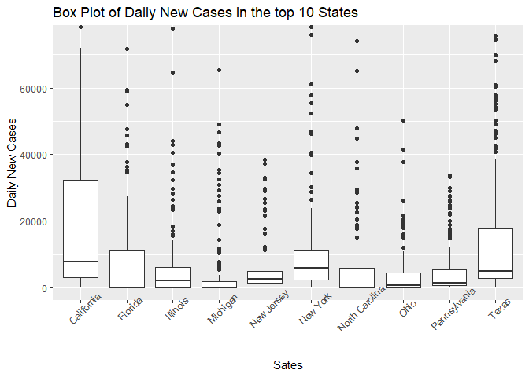

ST558_Project1_LanLin
================
Lan Lin
2022-06-11

-   [Part 1: Required packages](#part-1-required-packages)
-   [Part 2: API Interaction
    Functions](#part-2-api-interaction-functions)
-   [Part 3: Data manipulation](#part-3-data-manipulation)
-   [Part 4: EDA](#part-4-eda)
-   [Part 5: Conclusions](#part-5-conclusions)

# Part 1: Required packages

### To use the functions for interacting with the Covid API, I used the following packages:

-   `easypackage`: Easily load and install multiple packages from
    different sources
-   `httr`: Useful tools for working with HTTP organised by HTTP verbs
-   `tidyverse`: tons of useful features for data manipulation and
    visualization
-   `jsonlite`: API interaction
-   `DT`: Provides an R interface to the JavaScript library DataTables
-   `stringr`: Provides a cohesive set of functions designed to make
    working with strings as easy as possible.
-   `RColorBrewer`: Uses the work from <http://colorbrewer2.org/> to
    help us choose sensible color schemes for figures in R

# Part 2: API Interaction Functions

### 2.1 Write a function to read in the data set from API.

All queries are prefixed with <https://api.covid19api.com/> and are GET
requests unless otherwise noted.

``` r
# Write a function to read in the data set from API
get_Data <- function(url){
                myData<- GET(paste0("https://api.covid19api.com", url))
                parsed <- fromJSON(rawToChar(myData$content))
                return(parsed)
}
```

### 2.2 Write a function to rename the countries to match the names in map data set.

``` r
countries_Names <- function(countries){
  ifelse(countries %in% c("Antigua and Barbuda", "Brunei Darussalam", "Iran, Islamic Republic of", "Micronesia, Federated States of", "Taiwan, Republic of China", "Tanzania, United Republic of", "Trinidad and Tobago"), new_countries <- str_replace(word(countries, 1), ",", ""), 
         ifelse(countries == "Congo (Brazzaville)",  new_countries <- "Republic of Congo", 
                ifelse(countries == "Congo (Kinshasa)",  new_countries <- "Democratic Republic of the Congo",
                       ifelse(countries == "Korea (North)", new_countries <- "North Korea",
                              ifelse(countries == "Lao PDR", new_countries <- "Laos",
                                     ifelse(countries == "Macedonia, Republic of", new_countries <- "North Macedonia", 
                                            ifelse(countries == "Republic of Kosovo", new_countries <- "Kosovo", 
                                                  ifelse(countries == "Saint Vincent and Grenadines", new_countries <- "Saint Vincent",
                                                         ifelse(countries == "Syrian Arab Republic (Syria)", new_countries <- "Syria",
                                                                ifelse(countries == "United Kingdom", new_countries <- "UK",
                                                                       ifelse(countries == "United States of America", new_countries <- "USA",
                                                                              ifelse(countries == "Viet Nam", new_countries <-"Vietnam", 
                                                                                     ifelse(countries == "Saint Kitts and Nevis", new_countries <- "Saint Kitts", 
                                                                                            ifelse(countries == "Korea (South)", new_countries <- "South Korea",
                                                                                                   ifelse(countries == "Russian Federation", new_countries <- "Russia", 
                                                                                                          new_countries <- countries)))))))))))))))
}
```

### 2.3 Write a function to rename the countries in the population data set to match the names in the API data sets.

``` r
countries_Names_pop <- function(countries){
  ifelse(countries == "Antigua And Barbuda", new_Countries <- "Antigua and Barbuda",
         ifelse(countries == "Bosnia And Herzegovina", new_Countries <- "Bosnia and Herzegovina",
                ifelse(countries == "Czechia", new_Countries <- "Czech Republic",
                       ifelse(countries == "Democratic Republic Of The Congo", new_Countries <- "Congo (Kinshasa)",
                              ifelse(countries == "Congo", new_Countries <- "Congo (Brazzaville)",
                                     ifelse(countries == "Guinea Bissau", new_Countries <- "Guinea-Bissau",
                                            ifelse(countries == "Holy See", new_Countries <- "Holy See (Vatican City State)",
                                                   ifelse(countries == "Iran", new_Countries <- "Iran, Islamic Republic of", 
                                                          ifelse(countries == "South Korea", new_Countries <- "Korea (South)",
                                                                 ifelse(countries == "Laos", new_Countries <- "Lao PDR", 
                                                                        ifelse(countries == "North Macedonia", new_Countries <- "Macedonia, Republic of",
                                                                               ifelse(countries == "Micronesia (Federated States Of)", new_Countries <- "Micronesia, Federated States of", 
                     ifelse(countries == "Palestine", new_Countries <- "Palestinian Territory", 
                            ifelse(countries == "Kosovo", new_Countries <- "Republic of Kosovo",
                                   ifelse(countries == "Russia", new_Countries <- "Russian Federation",
                                          ifelse(countries == "Saint Kitts And Nevis", new_Countries <- "Saint Kitts and Nevis",
                                                 ifelse(countries == "Sao Tome And Principe", new_Countries <- "Sao Tome and Principe",
                                                        ifelse(countries == "Syria", new_Countries <- "Syrian Arab Republic (Syria)",
                                                               ifelse(countries == "Taiwan", new_Countries <- "Taiwan, Republic of China",
                                                                      ifelse(countries == "United Republic Of Tanzania", new_Countries <- "Tanzania, United Republic of",
                      ifelse(countries == "Timor Leste", new_Countries <- "Timor-Leste",
                             ifelse(countries == "Trinidad And Tobago", new_Countries <- "Trinidad and Tobago",
                                    ifelse(countries == "United States Of America", new_Countries <- "United States of America",
                                           ifelse(countries == "Venezuela", new_Countries <- "Venezuela (Bolivarian Republic)",
                                                  ifelse(countries == "Vietnam", new_Countries <- "Viet Nam", new_countries <- countries)))))))))))))))))))))))))
}
```

### 2.4 Write a function to create a week list based on start date and end date.

``` r
get_Date <- function(start, end){
  diff <- as.numeric(difftime(as.Date(end),as.Date(start)))
  start_date <- seq(as.Date(start), by = "week", length.out = diff %/% 7 +1)
  end_date <- c(seq(as.Date(start)+6, by = "week", length.out = diff %/% 7), end)
  return(list(start_date, end_date))
}
```

### 2.5 Create a user-friendly country name function

``` r
get_Country <- function(country){
  ifelse(toupper(country) %in% CountryCode$CountryCode, 
         Country <- CountryCode$Country[which(CountryCode$CountryCode %in% toupper(country))],
         Country <- country)
  return(Country)
}
```

### 2.6 Write a function to get the confirmed cases based on start date and end date of any country.

``` r
get_confirmed_data <- function(start, end, country){
  Week_list<-get_Date(start, end)
  web_url_1<-paste0("/country/","united-states","/status/confirmed?")
  country_data_total = data.frame()
  for(i in 1:length(Week_list[[1]])){
    web_url_2<-paste0(web_url_1,"from=",Week_list[[1]][[i]],"T00:00:00Z","&to=",Week_list[[2]][[i]],"T00:00:00Z")
    country_data <-get_Data(web_url_2)
    country_data_total<-rbind(country_data_total,country_data)
  }
  return (country_data_total)
}
```

### 2.7 Write a function to get the confirmed, recovered, deaths based on start date and end date of any country.

``` r
get_all_data <- function(start, end, country){
  Week_list<-get_Date(start, end)
  web_url_1<-paste0("/country/","united-states","?")
  country_data_total = data.frame()
  for(i in 1:length(Week_list[[1]])){
    web_url_2<-paste0(web_url_1,"from=",Week_list[[1]][[i]],"T00:00:00Z","&to=",Week_list[[2]][[i]],"T00:00:00Z")
    country_data <-get_Data(web_url_2)
    country_data_total<-rbind(country_data_total,country_data)
  }
  return (country_data_total)
}
```

# Part 3: Data manipulation

### 3.1 Read in the summary data set on current day.

This data set includes the numbers of new deaths, total deaths, new
recovered, total recovered of current day worldwide.

``` r
# Read in the data set
covid_summary <- get_Data("/summary")$Countries %>% as_tibble()

# Create a tibble to save country code
CountryCode <- covid_summary[2:3]

# Using the countries_Names function to create a new variable called new_Countries to match the country names in the map data set
covid_summary$new_Countries <- countries_Names(covid_summary$Country)
```

### 3.2 Read in the map data set.

``` r
# Read in the world map
mapdata <- map_data("world")

# Combine the map and covid_summary data sets 
mapData <- left_join(mapdata, covid_summary, by = c("region" = "new_Countries"))

# Remove the rows which do not contain total confirmed cases numbers 
mapdata1 <- mapData %>% filter(!is.na(mapData$TotalConfirmed))
```

### 3.3 Read in the population data set.

This is data set is downloaded from
“<https://www.ecdc.europa.eu/en/geographical-distribution-2019-ncov-cases>”.

``` r
# Read in the data set
pop <- distinct(read_csv("data.csv")[1:4])
```

    ## Rows: 53072 Columns: 11
    ## -- Column specification -----------------------------------------------------------------------------------------------------------------------------------------------------
    ## Delimiter: ","
    ## chr (6): country, country_code, continent, indicator, year_week, source
    ## dbl (4): population, weekly_count, rate_14_day, cumulative_count
    ## lgl (1): note
    ## 
    ## i Use `spec()` to retrieve the full column specification for this data.
    ## i Specify the column types or set `show_col_types = FALSE` to quiet this message.

``` r
# Using the countries_Names_pop function to create a new variable Country to match the country names in the covid_summary data set. 
pop$Country <- countries_Names_pop(pop$country)
pop <- pop[3:5]

# Combine the covid_summary and population data sets 
covid_summary_pop <- left_join(covid_summary, pop, by = "Country")
```

### 3.4 Create a tibble to plot histogram

``` r
# Create a new variable which represents the proportion of population who contrasted the corona virus 
covid_summary_hist <- covid_summary_pop %>% 
                      mutate(ConfirmedProportion = TotalConfirmed/population) %>%
                      select(Country, ConfirmedProportion) %>%
                      drop_na(ConfirmedProportion)
```

### 3.5 Read in the US confirmed cases information in the period of Jan 01, 20222 to May 31, 2022

``` r
# Read in the data set
US_Data <- get_confirmed_data("2022-01-01","2022-05-31","united-states")
# Check the data quality
summary(US_Data$Cases)
```

    ##     Min.  1st Qu.   Median     Mean  3rd Qu.     Max. 
    ##    -3073     2261     5764    46346    15361 84233849

The minimum total confirmed cases is -3073, which means that some data
entries were wrong. Since we are not able to fix the data, I just
removed the rows which had cases less than 0.

``` r
# Remove the rows which had cases less than 0, and create a new variable call NewCases
US_NewCase <- US_Data %>% 
              filter(Cases >= 0) %>%
              group_by(Province, City) %>%
              select(Cases, Date) %>%
              mutate(NewCases = Cases - lag(Cases, default = first(Cases))) %>%
              filter(Province != "" & NewCases >= 0)
```

    ## Adding missing grouping variables: `Province`, `City`

``` r
# Create a tibble to summary the total new cases by state
US_NewCase_StateSum <- US_NewCase %>%
                      group_by(Province) %>% 
                      summarise(TotalNewCases = sum(NewCases))

state_names <- pull(US_NewCase_StateSum %>% arrange(desc(TotalNewCases)) %>% top_n(10) %>% select(Province))
```

    ## Selecting by TotalNewCases

``` r
# Create a tibble to the new case information in the top 10 states 
US_NewCase_byState <- US_NewCase %>% group_by(Province, Date) %>% summarise(Sum = sum(NewCases)) %>% filter(Province %in% state_names)
```

    ## `summarise()` has grouped output by 'Province'. You can override using the `.groups` argument.

### 3.6 Read in the US confirmed, recovered, deaths information in the period of Jan 01, 20222 to May 31, 2022

``` r
# Read in the data set
US_all <- get_all_data("2022-01-01","2022-05-31","united-states")

# Check the data quality
apply(X= select(US_all, Confirmed: Active), MARGIN = 2, FUN = summary)
```

    ##           Confirmed       Deaths Recovered     Active
    ## Min.       -3073.00     -82.0000         0        0.0
    ## 1st Qu.     2261.00      31.0000         0     2227.0
    ## Median      5764.00      84.0000         0     5692.0
    ## Mean       46345.63     568.9481         0    45760.8
    ## 3rd Qu.    15361.00     209.0000         0    15125.0
    ## Max.    84233849.00 1007100.0000         0 83203776.0

Based on the summary result, I am going to remove the negative values
and Recovered variable from the data set.

``` r
# Create three new variables: NewConfirmed, NewDeaths, NewActive.
US_all_new <- US_all %>% filter(Confirmed >= 0 & Deaths >= 0) %>%
                group_by(Province, City) %>%
                select(Date, Confirmed, Deaths, Active) %>%
                mutate(NewConfirmed = Confirmed - lag(Confirmed, default = first(Confirmed)), 
                       NewDeaths = Deaths - lag(Deaths, default = first(Deaths)),
                       NewActive = Active - lag(Active, default = first(Active)))
```

    ## Adding missing grouping variables: `Province`, `City`

# Part 4: EDA

### 4.1 Plot a spatial data to show the coronavirus cases in the world

``` r
ggplot(mapdata1, aes(x= long, y =lat, group = group)) +
  geom_polygon(aes(fill = TotalConfirmed), color = "darkgreen") + 
  scale_fill_gradient(name = "Cases", low='#EEEEEE', high='darkgreen', na.value = "grey") +
  theme(axis.text.x = element_blank(),
        axis.text.y = element_blank(),
        axis.ticks = element_blank(),
        axis.title.y=element_blank(),
        axis.title.x=element_blank(),
        rect = element_blank()) +
  labs(title = "Coronavirus Worldwide")
```

<!-- --> This map
shows us that the United States of America has the largest total
confirmed cases, followed by India and Brazil. In order to further
demonstrate the corona virus cases by country, two tables are created.

### 4.2 Summary corona virus cases by country

``` r
case_tab <- covid_summary_pop %>% 
              select(c("Country", "continent", "NewConfirmed", "TotalConfirmed", "NewDeaths", "TotalDeaths", "population"))  %>%
                arrange(desc(TotalConfirmed)) %>%
                  rename(Continent = continent, Population = population)
datatable(case_tab)
```

<!-- -->

This table shows us that the United State of America, India and Brazil
had the most cases in the world.

### 4.3 Summary corona virus cases by continent

``` r
case_summary_tab <- covid_summary_pop %>% 
                      drop_na(continent) %>%  
                        group_by(continent) %>% 
                          summarise(ContinentTotalConfirmed = sum(TotalConfirmed), ContinentTotalDeaths =sum(TotalDeaths)) %>%
                            arrange(desc(ContinentTotalConfirmed))

row_names <- case_summary_tab$continent

case_summary_tab <- rbind(case_summary_tab[2:3],colSums(case_summary_tab[2:3]))
case_summary_tab <- as.data.frame(case_summary_tab)

rownames(case_summary_tab) <- c(row_names, "Total")

datatable(case_summary_tab)
```

<!-- -->

This table shows us that Europe has the largest total confirmed cases,
while America has the largest total deaths. The total confirmed cases
and total deaths are 540,740,012 and 6,318,769, respectively.

### 4.4 Create numerical summaries for total confirmed cases and deaths in different contients

``` r
#  Create numerical summaries for total confirmed cases and deaths in different consents
tapply(X= c(covid_summary_pop$TotalConfirmed), INDEX = covid_summary_pop$continent, FUN = summary)
```

    ## $Africa
    ##    Min. 1st Qu.  Median    Mean 3rd Qu.    Max. 
    ##    6023   20207   59346  228222  228082 3991944 
    ## 
    ## $America
    ##     Min.  1st Qu.   Median     Mean  3rd Qu.     Max. 
    ##     5941    64042   563063  4737311  1067409 86949088 
    ## 
    ## $Asia
    ##     Min.  1st Qu.   Median     Mean  3rd Qu.     Max. 
    ##    11824   217730   931660  3276452  3264804 43389973 
    ## 
    ## $Europe
    ##     Min.  1st Qu.   Median     Mean  3rd Qu.     Max. 
    ##       29   389586  1307006  4435278  4140892 30714200 
    ## 
    ## $Oceania
    ##    Min. 1st Qu.  Median    Mean 3rd Qu.    Max. 
    ##      18    4710   13446  791050   49893 8000312

This table summarize the minimum, first quantile, median, mean, third
quantile and maximum total confirmed cases in each continent. And the
America has the most confirmed cases among all the consents.

``` r
#  Create numerical summaries for total deaths in different consents
tapply(X= c(covid_summary_pop$TotalDeaths), INDEX = covid_summary_pop$continent, FUN = summary)
```

    ## $Africa
    ##     Min.  1st Qu.   Median     Mean  3rd Qu.     Max. 
    ##     38.0    254.5    992.0   4859.3   3263.0 101727.0 
    ## 
    ## $America
    ##      Min.   1st Qu.    Median      Mean   3rd Qu.      Max. 
    ##      43.0     821.2    6520.0   81071.6   32267.0 1015933.0 
    ## 
    ## $Asia
    ##    Min. 1st Qu.  Median    Mean 3rd Qu.    Max. 
    ##      21    2156    8456   31164   25052  524999 
    ## 
    ## $Europe
    ##    Min. 1st Qu.  Median    Mean 3rd Qu.    Max. 
    ##       0    3334   12692   39802   35905  373134 
    ## 
    ## $Oceania
    ##    Min. 1st Qu.  Median    Mean 3rd Qu.    Max. 
    ##     0.0    10.5    21.5  1070.6   712.8  9682.0

This table summarize the minimum, first quantile, median, mean, third
quantile and maximum total deaths in each continent. And the America has
the most deaths among all the consents.

### 4.5 Create a histogram to show the distribution of the proportion of population who contrasted the corona virus by country

``` r
ggplot(covid_summary_hist, aes(x= ConfirmedProportion)) +
  geom_histogram(binwidth = 0.02, fill="#69b3a2") +
  labs(title = "Histogram Plot of the Proportion of Confirmed Cases")
```

<!-- -->

This histogram shows us that most of the countries had less than 20% of
their population contracted the corona virus. These proportions were up
to roughly 60% in some countries. However, this numbers are highly
depending on the proportion of people who had covid test.

### 4.6 Create a scatter plot to show the relationship between total confirmed cases and total deaths by country

``` r
confirm_vs_death <-ggplot(covid_summary_pop, aes(x = TotalConfirmed, y = TotalDeaths))

confirm_vs_death + 
  geom_point() +
  scale_x_continuous(trans='log2') + scale_y_continuous(trans='log2') +
  geom_text(aes(label = Country, color = factor(continent)), size = 3.5, check_overlap = TRUE, vjust = "inward", hjust = "inward") +
  labs(title = "Scatter Plot of the relationship between total confirmed cases and total deaths by country", x= "log2(TotalDeaths)", y= "log2(TotalConfirmed)")
```

<!-- --> In this
scatter plot, I did log2 transformation on both TotalConfrimed and
TotalDeath. This plot shows us that log2(TotalConfrimed) and
log2(TotalDeath) had a roughly linear relationship among countries. The
number of total deaths increases as the number of total confirmed cases
increases. North Korea, Antarctica and Micronesia are outlines in this
plot. This may be due to the low mortality rate in the countries or lack
of data.

Since the United States had both the highest total confirmed cases and
total deaths, I would like to look into some details of US in the period
Jan 1, 2022 to May 31, 2022.

### 4.7 Create a table to summary the total new cases in the period Jan 1, 2022 to May 31, 2022 by state.

``` r
datatable(US_NewCase_StateSum %>% arrange(desc(TotalNewCases)))
```

<!-- -->

California, Florid and Texas had the most new cases in the period of Jan
1, 2022 to May 31.

### 4.8 Create a box plot of Daily New Cases in the top 10 States in the period of Jan 1, 2022 to May 31, 2022 by state.

``` r
ggplot(US_NewCase_byState, aes(x = Province, y = Sum)) +
  geom_boxplot() + 
  coord_cartesian(ylim=c(0, 75000)) +
  theme(axis.text.x = element_text(angle = 45)) +
  labs(x= "Sates", y= "Daily New Cases", title = "Box Plot of Daily New Cases in the top 10 States")
```

<!-- -->

This box plot shows us that California had the largest range and highest
daily new cases in the period of Jan 1, 2022 to May 31, 2022. And all
the top 10 states had a lot of outliers. Then I looked into the details
of the case information in California.

### 4.9 Create a contingency table to summarize the cities in California which had daily cases greater than 5,000 in the period of Jan 1, 2022 to May 31, 2022

``` r
CA_NewCases <- US_NewCase %>% filter(Province == "California" & NewCases >= 5000)
table(CA_NewCases$City)
```

    ## 
    ##        Alameda   Contra Costa         Fresno           Kern    Los Angeles         Orange      Riverside     Sacramento San Bernardino      San Diego  San Francisco 
    ##              6              4              3              3             47             16             14              5             12             24              3 
    ##    San Joaquin      San Mateo    Santa Clara     Unassigned        Ventura 
    ##              3              3             10              2              3

This contingency table shows us that Los Angeles had the most daily
cases greater than 5,000 in the period of Jan 1, 2022 to May 31, 2022,
followed by San Diego.

### 4.10 Create a Bar Plot of Days of Daily New Cases exceeded 5,000 in California

``` r
ggplot(CA_NewCases, aes(x= City)) + 
  geom_bar(fill="#69b3a2") + 
  theme(axis.text.x = element_text(angle = 45)) +
  labs(x= "California", y= "Days of Daily New Cases exceeded 5,000", title = "Bar Plot of Days of Daily New Cases exceeded 5,000 in California")
```

<!-- -->

This bar plot shows us that Los Angeles had the most days with daily
cases greater than 5,000 in the period of Jan 1, 2022 to May 31, 2022,
followed by San Diego.

### 4.11 Create a bar plot to show the daily new cases in Los Angeles, CA in the period of Jan 1, 2022 to May 31, 2022.

``` r
LA_all <- US_all_new %>% filter(Province == "California" & City == "Los Angeles") %>% 
                         select(Date, NewConfirmed : NewActive) %>%
                         pivot_longer(cols = 4:6, names_to = "CaseType", values_to = "Cases")

LA_all$Date <- as.Date(substr(LA_all$Date, 1, 11))

ggplot(data = LA_all, aes(x = Date, y = Cases)) +
  geom_col(aes(fill =CaseType))+
  theme(axis.text.x = element_text(angle = 45, size = 8.5)) +
  labs(title = "Daily New Cases in Los Angeles, CA")
```

<!-- -->

This plot shows us that the corona virus cases surged in January,2022 in
Los Angeles, CA. The new daily deaths were much samller than the new
active and new confirmed cases. So, it is hard to see it in the plot.

# Part 5: Conclusions

In this project, I created seven functions (get_Data, countries_Names,
countries_Names_pop, get_Date, get_Country, get_confirmed_data and
get_all_data) to interact with the coronavirus API. The data were pulled
from three endpoints (Summary, By Country and All Status By Country).
First, I plotted spatial data to show the coronavirus cases in the world
map. This map indicated that the United States of America had the
largest total confirmed cases, followed by India and Brazil. This
conclusion was confirmed by the coronavirus case summary by country.
Europe had the largest total confirmed cases, while America had the
largest total deaths.Then, I created a histogram to show that most of
the countries had less than 20% of their population contracted the
coronavirus. These proportions were up to roughly 60% in some countries.
The scatter plot showed us that log2(TotalConfrimed) and
log2(TotalDeath) had a roughly linear relationship among countries.
Since the US had the largest numbers of cases, I further looked into the
data in the US. California had the highest case numbers in the period of
Jan 1, 2022 to May 31, 2022, followed by Florida and Texas. In
California, Los Angeles had the most days with daily cases greater than
5,000. And the cases surged in Jan 2022 in Los Angeles, CA.
